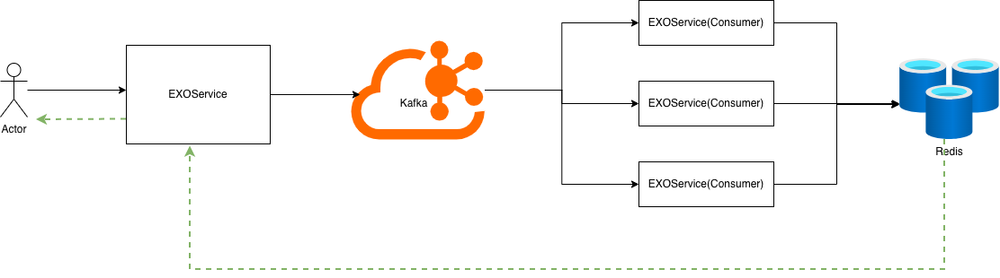
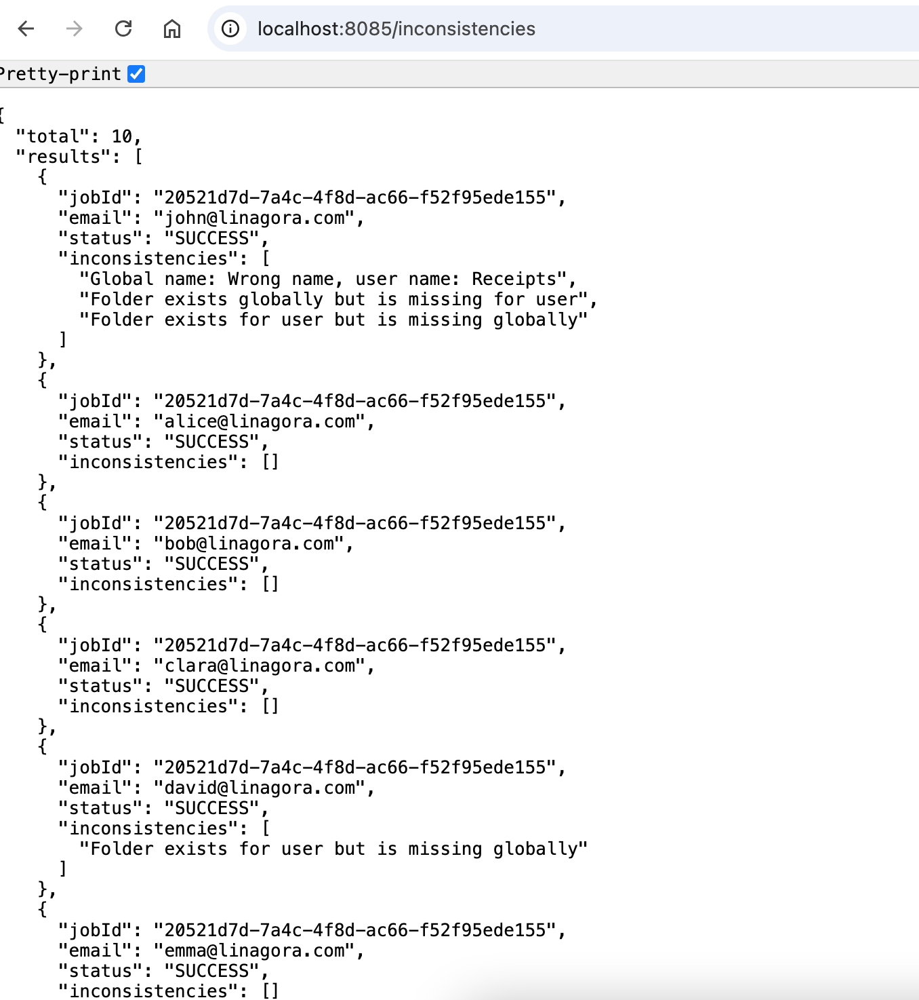

# Inconsistency Service

A Spring Boot application that checks inconsistencies for multiple users using Kafka, Redis, and Project Reactor.

## Processing Flow

```text
GET /inconsistencies
        |
        v
EXOService fetches users from the Mock API
        |
        v
Create a job in Redis
        |
        v
Publish one Kafka message per user
        |
        v
Multiple EXOService(consumer) instances consume messages in parallel: compare and push result to Redis
        |
        v
EXOService reactively polls Redis
        |
        v
Return the aggregated result to the client
```

1. The client calls `GET /inconsistencies`.
2. `EXOService` retrieves the user list from the mock `/users` API.
3. A job is created in Redis, push all user to Kafka.
4. `EXOService` can be horizontally scaled. Kafka distributes messages between consumers in the same consumer group.
5. Each consumer retrieves the user's folders, detects inconsistencies, and writes the result to Redis.
6. Failed messages are sent to a dead-letter topic and recorded as failed results.
7. Using Project Reactor, `EXOService` waits for all results in Redis without blocking threads and returns the aggregated response.

## Architecture

```text
Client
  |
  v
EXOService
  |------> Mock Users/Folders API
  |------> Kafka
  |------> Redis
              ^
              |
      EXOService x N
```

## Infrastructure

* Java and Spring Boot
* Spring WebFlux / Project Reactor
* Apache Kafka
* Redis
* Docker Compose
* NGINX mock API



## Run

```bash
docker compose up -d
```

Start `EXOService` application

```bash
cd EXOService
```
```bash
mvn clean package
```
```bash
java -jar target/*.jar
```

```bash
curl http://localhost:8085/inconsistencies
```

## Result



## Discussion

### 1. Cache `/folders` API

If the folder data does not change frequently, the `/folders` API could be cached (e.g., Redis or an in-memory cache). 
This would reduce repeated calls to the external service, improve response time, and decrease load on the upstream API.

### 2. Job Reuse

Currently, every request to `GET /inconsistencies` creates a new `jobId` and starts a new processing workflow.

An alternative design is to check whether a previous job is still running. If so, instead of creating a new job, the API could return the existing `jobId` (or its current result) until that job completes. 
This would avoid duplicate processing when multiple identical requests arrive within a short period.

## Future Improvements

The following improvements would be implemented:

* Provide a complete `docker-compose.yml` to start all services (Kafka, Redis, Mock API, EXOService, and EXOConsumerService) with a single command.
* Add integration tests covering the end-to-end workflow.
* Add metrics and monitoring (e.g., Prometheus/Grafana) for Kafka consumers and job processing.